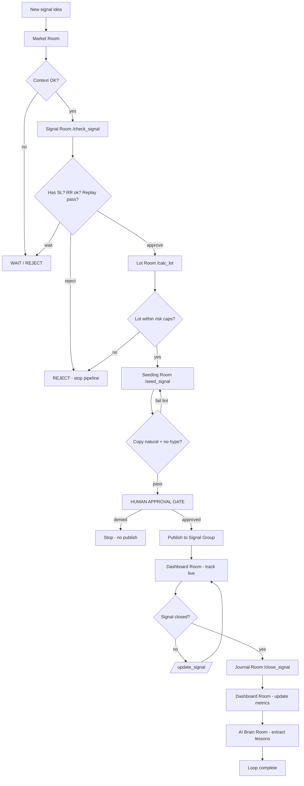

# Agent OS Operating Model — Hermes XAUUSD IB Trading Desk

> **Skill:** `agent-os-designer`  
> **Pattern source:** [Hermes Agent trading desk video](https://www.youtube.com/watch?v=MbfuJZZ01IU)  
> **Adapted flow:** 8 layers → 7 strategy rooms + Hermes orchestrator

---

## 1. Agent Room Architecture

### Orchestrator

| Component | Role |
|-----------|------|
| **Hermes XAUUSD Agent** | Routes Telegram commands → rooms → MCP/Python modules; enforces system rules |
| **Telegram Router** | `telegram_router.py` — parses `/check_signal`, `/calc_lot`, etc. |
| **XAUUSD Trading MCP** | Tool boundary wrapping Python modules for Hermes/Cursor |

### Room Stack (Sequential Pipeline)

```text
┌──────────────────────────────────────────────────────────────────────────┐
│                     HERMES XAUUSD AGENT (Orchestrator)                    │
│              telegram_router.py  │  system rules  │  approval gates       │
└─────────────────────────────────────┬────────────────────────────────────┘
                                      │
    ┌─────────┬─────────┬─────────┬────┴────┬─────────┬──────────┬──────────┐
    ▼         ▼         ▼         ▼         ▼         ▼          ▼          ▼
┌────────┐┌────────┐┌────────┐┌─────────┐┌─────────┐┌───────────┐┌───────────┐
│ Market ││ Signal ││  Lot   ││ Seeding ││ Journal ││ Dashboard ││ AI Brain  │
│  Room  ││  Room  ││  Room  ││  Room   ││  Room   ││   Room    ││   Room    │
└───┬────┘└───┬────┘└───┬────┘└────┬────┘└────┬────┘└─────┬─────┘└─────┬─────┘
    │         │         │          │          │           │            │
 market_   signal_   lot_     seeding_    journal.    dashboard.   ai_brain.
 context   gate      calc     engine      py          py           py
 .py       .py       ulator   .py
```

### Layer Mapping (Video → IB)

| Video layer | IB room(s) | Module |
|-------------|------------|--------|
| Hermes Agent | Orchestrator | `telegram_router.py` |
| Telegram | Command interface | `telegram_router.py` |
| Trader Dev MCP | XAUUSD Trading MCP | wraps all `src/` modules |
| Strategy Rooms | 7 rooms | room prompts + modules |
| Backtest | Signal Room (replay gate) | `signal_gate.py` |
| Dashboard | Dashboard Room | `dashboard.py` |
| AI Brain | AI Brain Room | `ai_brain.py` |
| Jarvis vision | **Deferred** | Phase 2+ |

### Room Paths

| Room | Repo path | Module |
|------|-----------|--------|
| Market Room | `strategy-rooms/market-room/` | `src/market_context.py` |
| Signal Room | `strategy-rooms/signal-room/` | `src/signal_gate.py` |
| Lot Room | `strategy-rooms/lot-room/` | `src/lot_calculator.py` |
| Seeding Room | `strategy-rooms/seeding-room/` | `src/seeding_engine.py` |
| Journal Room | `strategy-rooms/journal-room/` | `src/journal.py` |
| Dashboard Room | `dashboard/ib-signals/` | `src/dashboard.py` |
| AI Brain Room | `knowledge/brain/` | `src/ai_brain.py` |

---

## 2. Agent Loop Diagram

### Primary Loop — New Signal



### Command-Driven Short Loops

```text
/check_signal  → Market Room → Signal Room
/calc_lot      → Lot Room (requires approved signal_id)
/seed_signal   → Seeding Room (requires lot_plan)
/update_signal → Signal Room + Dashboard Room (live tracking)
/close_signal  → Journal Room → Dashboard Room → AI Brain Room
/dashboard     → Dashboard Room (read-only)
/brain         → AI Brain Room (read-only)
```

### Cron Loop (Optional — Forward Test Review)

```text
[cron 30m]
  → list open signals (Dashboard Room)
  → if forward_test stale → notify Alex via Telegram
  → no auto-publish
```

---

## 3. Room Contracts (Full Spec)

---

### Room 1 — Market Room

| Field | Definition |
|-------|------------|
| **Mission** | Read XAUUSD market context: session, spread, volatility, news risk |
| **Inputs** | `symbol`, `timestamp`, optional quote feed / manual spread |
| **Outputs** | `market_context.json` |
| **Permissions** | Read market data; write context file — **autonomous** |
| **Stop conditions** | Symbol != XAUUSD; timestamp missing; feed unavailable → use manual stub with `confidence: low` flag |
| **Failure modes** | Stale quote; spread spike; high-impact news within 30 min |
| **Escalation** | `news_risk: high` → Signal Room should prefer wait/reject unless news-aware setup |
| **Telegram command** | `/check_signal` (step 1) or implicit before signal check |
| **Example output** | See § Room Examples below |

---

### Room 2 — Signal Room

| Field | Definition |
|-------|------------|
| **Mission** | Validate signal structure; run replay gate; return approve / wait / reject |
| **Inputs** | Signal draft, `market_context.json`, replay dataset, room config |
| **Outputs** | `signal_decision.json`, `replay_result.json` |
| **Permissions** | Read/write signal-room files; run replay — **autonomous** until publish |
| **Stop conditions** | **No SL → reject**; RR < 1.5 → reject; replay fail on new setup → reject; martingale pattern detected → reject |
| **Failure modes** | Missing fields; session mismatch; insufficient replay sample |
| **Escalation** | Reject → stop entire pipeline; Wait → notify Alex, do not proceed to Lot Room |
| **Telegram command** | `/check_signal` |
| **Example output** | See § Room Examples |

**System rules enforced:** No signal without SL. No trade if Signal Room rejects. No martingale.

---

### Room 3 — Lot Room

| Field | Definition |
|-------|------------|
| **Mission** | Calculate safe lot per client group from SL distance and risk % |
| **Inputs** | Approved `signal_decision.json`, `client-groups.yaml`, account assumptions |
| **Outputs** | `lot_plan.json` |
| **Permissions** | Read groups config; write lot plan — **autonomous** |
| **Stop conditions** | Signal not approved; SL missing; lot exceeds max_lot; **recovery lot increase request → reject** |
| **Failure modes** | Invalid SL distance; unknown client group |
| **Escalation** | Lot cap hit → return max allowed with warning flag; never increase lot to recover losses |
| **Telegram command** | `/calc_lot {signal_id}` |
| **Example output** | See § Room Examples |

**System rules enforced:** Lot Room follows risk, not commission. No increasing lot to recover losses.

---

### Room 4 — Seeding Room

| Field | Definition |
|-------|------------|
| **Mission** | Prepare natural, calm, professional Telegram messages around the signal |
| **Inputs** | Approved signal, `market_context.json`, `lot_plan.json`, seeding guidelines |
| **Outputs** | `seeding_messages.md`, formatted signal per `signal-format.md` |
| **Permissions** | Generate copy — **autonomous**; publish — **human approval** |
| **Stop conditions** | Lint fail (profit guarantee, FOMO phrases); signal not approved |
| **Failure modes** | Tone too promotional; too many messages (>3) |
| **Escalation** | Lint fail → regenerate once; second fail → escalate to Alex |
| **Telegram command** | `/seed_signal {signal_id}` |
| **Example output** | See § Room Examples |

---

### Room 5 — Journal Room

| Field | Definition |
|-------|------------|
| **Mission** | Record every closed signal: entry, exit, result, R, lesson |
| **Inputs** | Closed signal data from `/close_signal`, live track history |
| **Outputs** | Append to `journal-room/entries.jsonl` |
| **Permissions** | Append-only write — **autonomous on close** |
| **Stop conditions** | Signal still open → refuse close without exit data |
| **Failure modes** | Duplicate close; missing result field |
| **Escalation** | Missing exit price → ask Alex via Telegram before journaling |
| **Telegram command** | `/close_signal {signal_id} {result} {r} {notes}` |
| **Example output** | See § Room Examples |

**System rules enforced:** Journal Room must record every closed signal.

---

### Room 6 — Dashboard Room

| Field | Definition |
|-------|------------|
| **Mission** | Aggregate and display signal status, lot, PnL, journal entries, lessons |
| **Inputs** | All room outputs, journal jsonl, brain outcomes |
| **Outputs** | `dashboard/state.json`, static HTML view |
| **Permissions** | Read all desk data — **autonomous**; write dashboard state — **autonomous**; no external publish |
| **Stop conditions** | Corrupt JSON → rebuild from source files |
| **Failure modes** | Stale state; missing signal_id reference |
| **Escalation** | Data conflict → prefer journal as source of truth for closed signals |
| **Telegram command** | `/dashboard` or `/update_signal {signal_id} {status}` |
| **Example output** | See § Room Examples |

**Must show:** signal status, lot, PnL, journal, lessons.

---

### Room 7 — AI Brain Room

| Field | Definition |
|-------|------------|
| **Mission** | Extract lessons from journal data only; update pairings and outcomes |
| **Inputs** | `journal-room/entries.jsonl` **only** — never invent results |
| **Outputs** | `knowledge/brain/outcomes.jsonl`, `pairings.md` updates |
| **Permissions** | Append outcomes; update pairings — **autonomous after journal exists** |
| **Stop conditions** | No journal entry for signal_id → **refuse to learn** |
| **Failure modes** | Hallucinated outcome; learning from open signal |
| **Escalation** | Conflicting journal vs operator note → Alex resolves manually |
| **Telegram command** | `/brain` or `/brain {signal_id}` |
| **Example output** | See § Room Examples |

**System rules enforced:** AI Brain can only learn from journal data, not invent results.

---

## 4. Permission Matrix

| Action | Market | Signal | Lot | Seeding | Journal | Dashboard | Brain | Hermes | Alex |
|--------|--------|--------|-----|---------|---------|-----------|-------|--------|------|
| Read market context | ✅ | ✅ | — | ✅ | — | ✅ | — | ✅ | ✅ |
| Validate / replay signal | — | ✅ | — | — | — | ✅ | — | ✅ | ✅ |
| Approve signal for pipeline | — | ✅* | — | — | — | — | — | — | ✅ |
| Calculate lot plan | — | — | ✅ | — | — | ✅ | — | ✅ | ✅ |
| Generate seeding copy | — | — | — | ✅ | — | — | — | ✅ | ✅ |
| Publish to Signal Group | — | — | — | —** | — | — | — | — | ✅ |
| Track live signal | — | ✅ | — | — | — | ✅ | — | ✅ | ✅ |
| Append journal | — | — | — | — | ✅ | — | — | ✅ | ✅ |
| Update dashboard state | — | — | — | — | — | ✅ | — | ✅ | ✅ |
| Update brain | — | — | — | — | — | — | ✅† | ✅ | ✅ |
| Read brain / dashboard | ✅ | ✅ | ✅ | ✅ | ✅ | ✅ | ✅ | ✅ | ✅ |
| Broker execution | ❌ | ❌ | ❌ | ❌ | ❌ | ❌ | ❌ | ❌ | ❌ |
| Client passwords | ❌ | ❌ | ❌ | ❌ | ❌ | ❌ | ❌ | ❌ | ❌ |
| CRM / funnel / content | ❌ | ❌ | ❌ | ❌ | ❌ | ❌ | ❌ | ❌ | ❌ |
| Promote setup to `live` | — | — | — | — | — | — | — | — | ✅ |
| Increase lot for recovery | ❌ | ❌ | ❌ | ❌ | ❌ | ❌ | ❌ | ❌ | ❌ |

\* Signal Room may auto-approve only when all rules pass; Alex can override reject→wait.  
\** Seeding generates copy; publish is Alex-gated.  
† Brain writes only when journal entry exists for signal_id.

---

## 5. Stop Condition Table

| ID | Condition | Room | Action | Resume |
|----|-----------|------|--------|--------|
| S1 | No SL on signal | Signal | REJECT, halt pipeline | Fix signal draft |
| S2 | RR < 1.5 | Signal | REJECT | Adjust levels |
| S3 | Martingale / double-lot recovery detected | Signal / Lot | REJECT | Remove pattern |
| S4 | Signal Room reject | All downstream | HALT — no lot, seed, publish | New signal or override by Alex |
| S5 | Replay gate fail (new setup) | Signal | REJECT promotion | Improve setup, re-replay |
| S6 | Spread > threshold | Market / Signal | WAIT | Re-check next tick |
| S7 | news_risk high + non-news setup | Signal | WAIT or REJECT | Wait for news pass |
| S8 | Signal not approved | Lot, Seeding | REFUSE command | Run /check_signal first |
| S9 | Seeding lint fail (2x) | Seeding | ESCALATE to Alex | Manual edit |
| S10 | Publish without human approval | Telegram | BLOCK | Alex approves |
| S11 | Close without exit data | Journal | ASK Alex | Provide exit |
| S12 | Brain learn without journal | Brain | REFUSE | Run /close_signal first |
| S13 | Execution API request | Any | REFUSE | Out of scope |
| S14 | Profit guarantee in copy | Seeding | REGENERATE or BLOCK | Fix copy |

---

## 6. Failure Mode Table

| Failure | Likely cause | Detection | Recovery | Prevention |
|---------|--------------|-----------|----------|------------|
| False approve | Weak gate thresholds | Replay audit | Tighten gate; re-run replay | Mandatory replay for new setups |
| Publish while open conflict | Race / manual error | Dashboard duplicate check | Unpublish manually; fix state | Human gate on publish |
| Wrong lot size | Bad SL distance or group config | Lot > max_lot check | Recalculate with `lot_calculator` | Validate SL before lot |
| Robotic seeding | Template spam | Seeding lint + Alex review | Regenerate with session context | `seeding-guidelines.md` |
| Brain hallucination | Learn without journal | signal_id not in journal | Delete bad brain row; re-run from journal | `ai_brain.py` journal-only guard |
| Stale dashboard | Missed /update_signal | Timestamp > 4h stale | Rebuild `dashboard/state.json` | Cron stale check |
| Telegram router crash | Bad command args | Exception log | Return usage help | Input validation in router |
| Martingale slip-through | Manual lot override | Recovery keyword detect | Reject in lot_calculator | Hard rule in signal_gate + lot |
| Overtrading pressure | Too many signals/day | Daily signal count | Pause; Alex review | Quality metrics over volume |
| Data file corrupt | Partial write | JSON parse fail | Restore from git | Append-only journal/brain |

---

## 7. Room Examples (Telegram Command + Output)

### Market Room

**Command:** (implicit in `/check_signal`)

**Output:**
```json
{
  "symbol": "XAUUSD",
  "session": "london",
  "spread_pts": 28,
  "volatility": "normal",
  "news_risk": "low",
  "ts": "2026-06-29T08:00:00Z"
}
```

### Signal Room — `/check_signal`

**Command:**
```text
/check_signal sig-001
```

**Output:**
```json
{
  "signal_id": "sig-001",
  "decision": "approve",
  "reason": "SL present, RR 2.1, london session fit, replay pass",
  "replay": { "win_rate": 0.58, "avg_r": 1.7, "pass": true }
}
```

**Reject example:**
```json
{
  "signal_id": "sig-002",
  "decision": "reject",
  "reason": "No SL defined — system rule S1"
}
```

### Lot Room — `/calc_lot`

**Command:**
```text
/calc_lot sig-001
```

**Output:**
```json
{
  "signal_id": "sig-001",
  "groups": [
    { "name": "conservative", "risk_pct": 0.5, "lot": 0.01 },
    { "name": "standard", "risk_pct": 1.0, "lot": 0.02 }
  ],
  "recovery_lot_blocked": false
}
```

### Seeding Room — `/seed_signal`

**Command:**
```text
/seed_signal sig-001
```

**Output:**
```markdown
## Context
London open — XAUUSD cleared Asian range high. Volatility normal. No high-impact USD news in 30 min.

## Signal
🥇 XAUUSD | London Breakout
📊 BUY @ 2345.50
🛑 SL: 2340.00
🎯 TP: 2355.00
📐 RR: 1:2.1
⚠️ Risk reminder: Size for your account. Past results ≠ future results.
```

### Live Track — `/update_signal`

**Command:**
```text
/update_signal sig-001 hit_tp
```

**Output:**
```json
{
  "signal_id": "sig-001",
  "status": "closed_tp",
  "pnl_r": 2.1,
  "dashboard_updated": true
}
```

### Journal Room — `/close_signal`

**Command:**
```text
/close_signal sig-001 win 2.1 Clean London breakout, low spread
```

**Output:**
```json
{
  "signal_id": "sig-001",
  "result": "win",
  "r": 2.1,
  "lesson": "Clean London breakout, low spread",
  "journal_appended": true
}
```

### Dashboard Room — `/dashboard`

**Command:**
```text
/dashboard
```

**Output:**
```json
{
  "open_signals": 0,
  "last_closed": "sig-001",
  "rolling_30": { "wins": 18, "losses": 12, "avg_r": 1.6 },
  "last_journal": "sig-001 win +2.1R",
  "last_lesson": "London breakout + low spread → pass"
}
```

### AI Brain Room — `/brain`

**Command:**
```text
/brain sig-001
```

**Output:**
```json
{
  "signal_id": "sig-001",
  "source": "journal",
  "outcome_appended": true,
  "pairing_updated": "london-breakout + low spread + london session → win 2.1R"
}
```

---

## 8. System Rules (Enforced in Code)

| Rule | Enforced in |
|------|-------------|
| No signal without SL | `signal_gate.py` |
| No martingale | `signal_gate.py`, `lot_calculator.py` |
| No recovery lot increase | `lot_calculator.py` |
| No trade if Signal Room rejects | `telegram_router.py` |
| Lot follows risk, not commission | `lot_calculator.py` |
| Seeding natural, calm, professional | `seeding_engine.py` |
| Journal every closed signal | `journal.py`, `telegram_router.py` |
| Brain learns from journal only | `ai_brain.py` |
| Dashboard shows status, lot, PnL, journal, lessons | `dashboard.py` |
| No execution / CRM / funnel / content | All modules + router |

---

## Related Docs

- [Architecture](./architecture.md)
- [Permission Matrix](./permission-matrix.md)
- [Guardrails](./guardrails.md)
- [MVP Build Map](./mvp-build-map.md)
- Room prompts: `workbook/rooms/`
